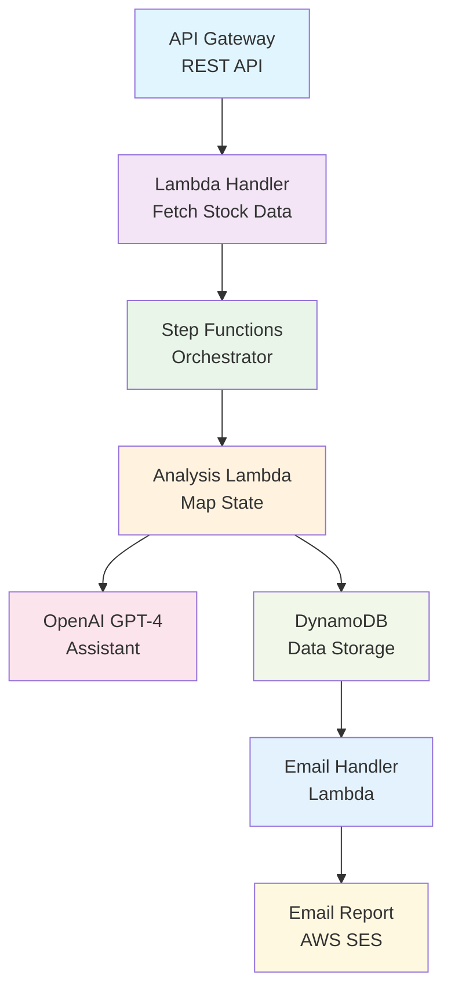

# Stock Analysis Platform

A serverless stock analysis platform that combines multiple financial APIs with OpenAI to provide automated stock analysis and email reports. Built with AWS CDK, TypeScript, and serverless architecture.

## Overview

This project creates an end-to-end stock analysis solution that:
- Fetches stock data from multiple financial APIs (Alpha Vantage, Polygon.io)
- Performs analysis using OpenAI's GPT-4
- Orchestrates workflows using AWS Step Functions
- Delivers email reports via AWS SES
- Manages user data and API keys with DynamoDB and AWS SSM

## Architecture

### Core Components



### Technology Stack

**Backend & Infrastructure:**
- **AWS CDK** - Infrastructure as Code
- **AWS Lambda** - Serverless compute
- **AWS Step Functions** - Workflow orchestration
- **AWS API Gateway** - REST API management
- **AWS DynamoDB** - NoSQL database
- **AWS SES** - Email delivery
- **AWS SSM** - Secure parameter storage

**APIs & Services:**
- **Alpha Vantage API** - Stock fundamentals and news sentiment
- **Polygon.io API** - Historical data and related companies
- **OpenAI GPT-4** - AI-powered analysis and insights

**Development:**
- **TypeScript** - Type-safe development
- **Jest** - Testing framework
- **ESBuild** - Fast bundling

## Key Features

### 1. Multi-API Data Integration
- **Alpha Vantage**: Company fundamentals, news sentiment, current pricing
- **Polygon.io**: Historical price data, financial statements, related companies
- Data correlation and validation

### 2. AI Analysis
- OpenAI Assistant for stock analysis
- News sentiment analysis and summarization
- Technical and fundamental analysis
- Investment recommendations

### 3. Serverless Architecture
- **Step Functions** for workflow orchestration
- **Map State** for parallel processing of multiple stocks
- **Lambda functions** for microservice architecture
- **DynamoDB** with Global Secondary Indexes for querying

### 4. Email Reports
- HTML-formatted analysis reports
- Markdown to HTML conversion
- Multi-stock comparison reports
- Automated delivery via AWS SES

### 5. Security & Configuration
- API keys stored in AWS SSM Parameter Store
- User-specific API key management
- IAM roles with appropriate permissions
- Environment-based configuration

## Project Structure

```
stock-analyzer/
├── infrastructure/           # AWS CDK Infrastructure
│   ├── lib/
│   │   ├── base.stack.ts    # Base DynamoDB table
│   │   └── stock-summary.stack.ts  # Main application stack
│   └── bin/
│       └── stock-summary.app.ts    # CDK app entry point
├── src/                     # Application source code
│   ├── alpha-advantage/     # Alpha Vantage API integration
│   ├── polygon-api/         # Polygon.io API integration
│   ├── sentiment-handler/   # OpenAI analysis logic
│   ├── related-companies/   # Company discovery service
│   ├── email-handler/       # Email report generation
│   ├── stock-tracker/       # Historical analysis tools
│   ├── dynamodb/           # Database client
│   ├── ssm/                # Parameter store client
│   └── stepFunction/       # Step Functions client
└── test/                   # Test suites
```

## Getting Started

### Prerequisites
- Node.js 18+
- AWS CLI configured
- AWS CDK installed (`npm install -g aws-cdk`)
- API keys for Alpha Vantage, Polygon.io, and OpenAI

### Installation

1. **Clone the repository**
   ```bash
   git clone <repository-url>
   cd stock-analyzer
   ```

2. **Install dependencies**
   ```bash
   # Install infrastructure dependencies
   cd infrastructure
   npm install
   
   # Install application dependencies
   cd ../src
   npm install
   ```

3. **Configure AWS parameters**
   ```bash
   # Store API keys in AWS SSM Parameter Store
   aws ssm put-parameter --name "alpha-vantage-key" --value "YOUR_KEY" --type "SecureString"
   aws ssm put-parameter --name "polygon-key" --value "YOUR_KEY" --type "SecureString"
   aws ssm put-parameter --name "open-ai-key" --value "YOUR_KEY" --type "SecureString"
   ```

4. **Deploy infrastructure**
   ```bash
   cd infrastructure
   cdk deploy
   ```

### Usage

**API Endpoint:**
```bash
POST https://your-api-gateway-url/analysis
Content-Type: application/json

{
  "emailTo": "user@example.com",
  "ticker": "AAPL",
  "compare": true
}
```

**Response:**
- Triggers Step Function workflow
- Analyzes requested stock and related companies
- Sends comprehensive email report

## Testing

```bash
# Run unit tests
cd src
npm test

# Run infrastructure tests
cd ../infrastructure
npm test
```

## Technical Implementation

### AWS Services Used
- **Step Functions Map State**: Parallel processing of multiple stocks
- **Global Secondary Indexes**: Querying by group ID
- **Lambda Functions**: Serverless compute
- **API Gateway**: RESTful API with error handling

### TypeScript Implementation
- **Type definitions** for API responses and data structures
- **Interface definitions** for external API contracts
- **Type-safe** AWS SDK usage
- **Error handling** throughout the application

### AI Integration
- **OpenAI Assistant** for financial analysis
- **Context-aware prompts** for relevant insights
- **Sentiment analysis** of financial news
- **Structured output** for consistent reporting

### Security Implementation
- **IAM policies** with appropriate permissions
- **Encrypted parameter storage** in SSM
- **User-specific API key management**
- **Input validation** and sanitization

## Skills Demonstrated

This project showcases experience with:

- **Cloud Architecture**: Serverless design patterns, microservices, event-driven architecture
- **AWS Services**: Lambda, Step Functions, DynamoDB, API Gateway, SES, SSM
- **Infrastructure as Code**: AWS CDK with TypeScript
- **API Integration**: RESTful services, error handling, data processing
- **AI Integration**: OpenAI API, prompt engineering, structured outputs
- **Data Processing**: Data transformation, aggregation, ETL patterns
- **Security**: IAM, encryption, secure parameter management
- **Testing**: Unit tests, integration tests, mocking external services

## Future Enhancements

- **Real-time WebSocket** updates for live analysis
- **Machine Learning models** for price prediction
- **Portfolio tracking** and performance analytics
- **Mobile application** with React Native
- **Charting** with D3.js or Chart.js
- **Social features** for sharing analyses

## License

This project is for educational and portfolio purposes.

---

*Built to demonstrate full-stack development skills and cloud architecture experience.*
